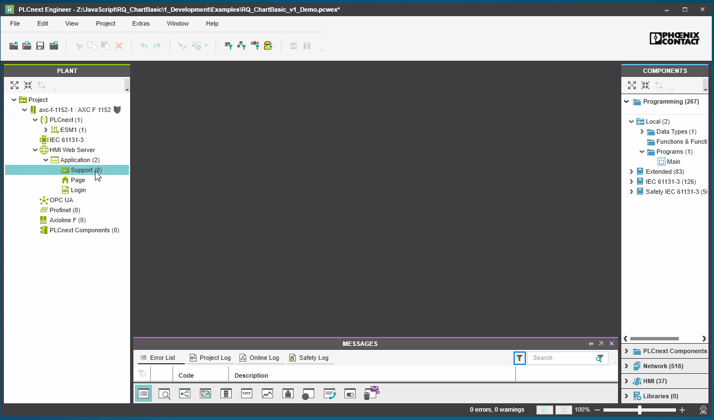
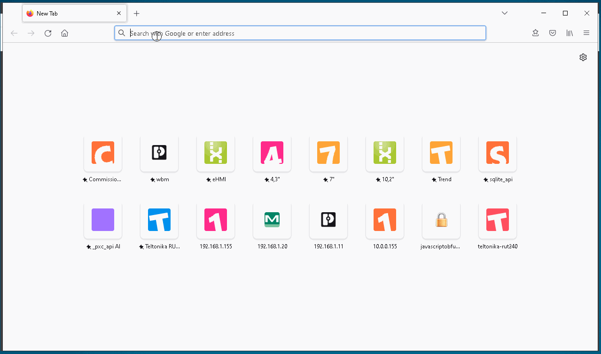

1. Download and extract _RQ_ChartBasic.zip_.

2. Attach _rq_chartbasic.html_ file to PLCnext Engineer project and make variables visible setting as _global_ with _HMI Tag_.

3. Use any browser to connect to the html page at _https://_<IP_ADDRESS>_/ehmi/rq_chartbasic.html_

